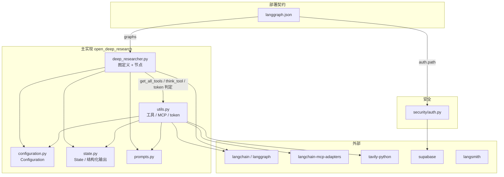
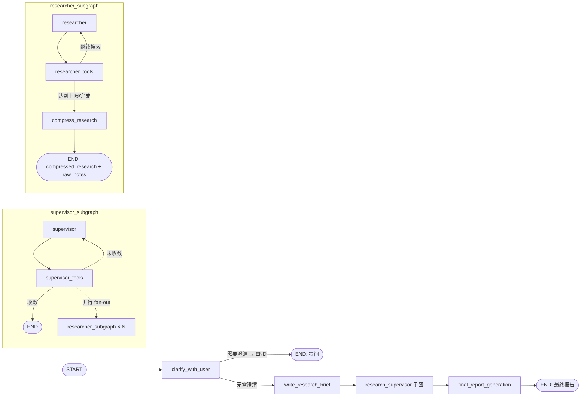
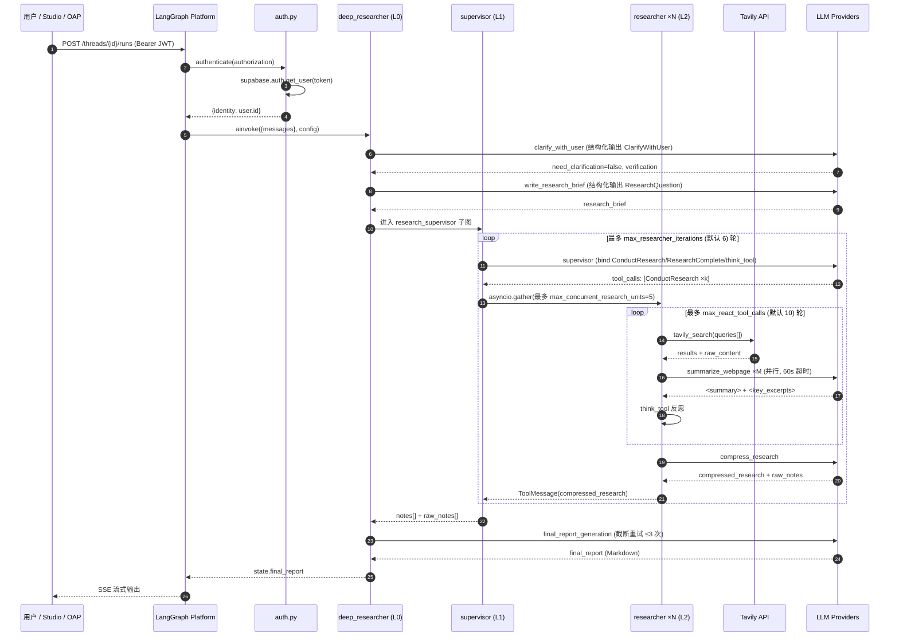
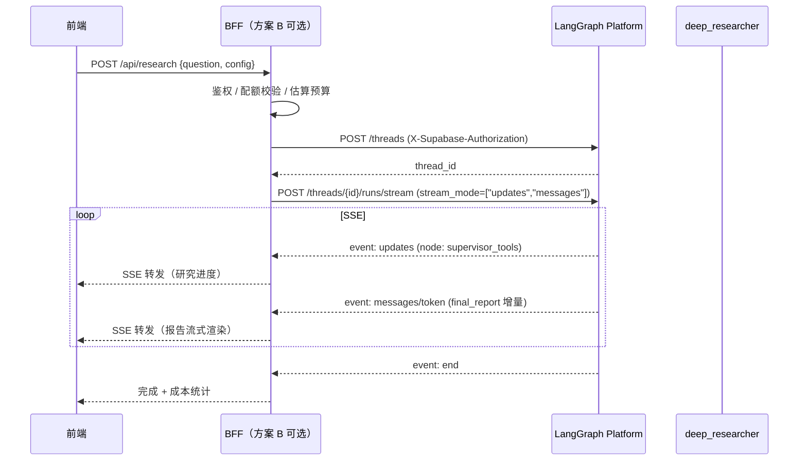

# Open Deep Research 代码库研究报告

> **报告版本**：v1.0
> **分析日期**：2026-09-04
> **分析对象**：`open_deep_research` v0.0.16（`pyproject.toml:3`），Git 分支 `main`，工作区干净
> **代码规模**：Python 22 个文件，共 6,543 行；Markdown 文档若干；Notebook 2 个
> **分析方法**：全量源码通读（`src/open_deep_research/**`、`src/legacy/**`、`src/security/**`、`tests/**`）+ 配置/依赖/部署清单交叉验证

---

## 目录

- [1. 项目概览](#1-项目概览)
- [2. 详细运行流程](#2-详细运行流程)
- [3. 重点与难点分析](#3-重点与难点分析)
- [4. 传统软件测试全流程可行性讨论](#4-传统软件测试全流程可行性讨论)
- [5. 增加前端页面的可行性讨论](#5-增加前端页面的可行性讨论)
- [6. 结论与行动建议](#6-结论与行动建议)
- [附录 A：代码位置索引](#附录-a代码位置索引)

---

## 1. 项目概览

### 1.1 项目类型定位

| 维度 | 结论 |
| --- | --- |
| 项目类型 | **AI Agent 应用 / 可编排工作流库**（不是 Web 服务） |
| 交付形态 | Python 包 `open_deep_research`，以 **LangGraph 图对象** 为唯一对外契约 |
| 是否有 HTTP 层 | **无自建后端**。HTTP 能力由 LangGraph Platform（`langgraph dev` / 云托管）提供 |
| 是否有前端 | **无**。官方 UI 依赖 LangGraph Studio 与 Open Agent Platform（OAP，外部项目） |
| 主流程 | 用户提问 → 澄清（可选）→ 生成研究简报 → 主管智能体并行分派子研究员 → 压缩 → 生成最终报告 |
| 运行特征 | 长耗时（分钟级）、高并发 I/O（LLM + 搜索 API）、高可变成本（按 token/次计费）、强外部依赖 |

一句话概括：**这是一个"以图（Graph）为主干、以 LLM 为控制流、以搜索/MCP 工具为触手"的深度研究编排引擎，本身不含任何传输层与展示层。**

### 1.2 技术栈

**核心框架**

- `langgraph>=0.5.4` — 状态图编排、子图、并行、`Command` 路由、检查点（`src/open_deep_research/deep_researcher.py`）
- `langchain-core` / `langchain` — `init_chat_model` 统一模型初始化、`with_structured_output`、`bind_tools`
- `langchain-mcp-adapters>=0.1.6` + `mcp>=1.9.4` — Model Context Protocol 工具接入
- `pydantic v2` — 配置模型、结构化输出、状态 Schema

**模型 Provider（通过 `init_chat_model` 的 `provider:model` 字符串协议）**

| Provider | 依赖包 |
| --- | --- |
| OpenAI | `langchain-openai>=0.3.28`、`openai>=1.99.2` |
| Anthropic | `langchain-anthropic>=0.3.15` |
| Google（GenAI / VertexAI） | `langchain-google-genai`、`langchain-google-vertexai` |
| DeepSeek | `langchain-deepseek>=0.1.2` |
| Groq | `langchain-groq>=0.2.4` |
| AWS Bedrock | `langchain-aws>=0.2.28` |

**搜索 / 检索**

`langchain-tavily` + `tavily-python`（默认）、OpenAI / Anthropic 原生 Web Search（服务端工具）、`duckduckgo-search`、`exa-py`、`linkup-sdk`、`arxiv`、`pymupdf`（PDF 解析，`legacy` 主要使用）、Azure AI Search（`azure-search-documents`）。

**基础设施**

- `langgraph-cli[inmem]` — 本地 dev server（LangGraph Studio）
- `langsmith>=0.3.37` — 追踪 + 数据集评估
- `supabase>=2.15.3` + `langgraph-sdk` — 鉴权与用户级数据隔离
- `aiohttp`、`httpx`、`markdownify`、`beautifulsoup4`、`pandas`、`rich`

**工程工具**：`uv`（锁文件 `uv.lock`）、`ruff`（`pyproject.toml:67-89`，启用 E/F/I/D/UP + `T201`）、`mypy`（`dev` 可选依赖）、`pytest`（**已在主依赖中**，`pyproject.toml:31`）。

### 1.3 目录结构

```
open_deep_research/
├── langgraph.json                        # 部署契约：图入口 + 鉴权入口
├── pyproject.toml                        # 依赖 / 打包 / ruff 配置
├── uv.lock                               # 依赖锁定
├── .env.example                          # 环境变量模板（13 行）
├── .github/
│   ├── dependabot.yml
│   └── workflows/
│       ├── claude.yml                    # Claude Code 自动化
│       └── claude-code-review.yml        # AI Code Review
├── examples/                             # 产出样例（4 篇 markdown 报告）
│
├── src/
│   ├── open_deep_research/               # ★ 当前主力实现（2,360 行，无 __init__.py）
│   │   ├── deep_researcher.py    (719)   # 三层图定义 + 全部节点函数
│   │   ├── utils.py              (925)   # 搜索工具 / MCP / token 限制 / key 管理
│   │   ├── prompts.py            (368)   # 7 套系统提示词模板
│   │   ├── configuration.py      (252)   # Configuration + SearchAPI + MCPConfig
│   │   └── state.py               (96)   # State Schema + 结构化输出模型
│   │
│   ├── legacy/                           # 历史实现（3,318 行，已不推荐）
│   │   ├── __init__.py             (3)
│   │   ├── graph.py               (503)   # 方案 A：Plan-and-Execute + 人工审批
│   │   ├── multi_agent.py         (488)   # 方案 B：Supervisor-Researcher
│   │   ├── utils.py             (1,635)   # 9 种搜索后端 + 重排 + 抓取
│   │   ├── prompts.py             (513)
│   │   ├── state.py                (73)
│   │   ├── configuration.py       (106)
│   │   ├── graph.ipynb / multi_agent.ipynb
│   │   └── tests/                        # 仅覆盖 legacy 的 pytest 用例
│   │       ├── conftest.py         (18)  # 自定义命令行参数
│   │       ├── test_report_quality.py (294)
│   │       └── run_test.py        (166)  # 基于 rich 的测试运行器
│   │
│   └── security/
│       └── auth.py               (156)   # LangGraph 鉴权中间件（Supabase JWT）
│
└── tests/                                # 注意：不是单测，是 LLM-as-judge 评估套件
    ├── run_evaluate.py            (90)   # LangSmith 批量评估入口
    ├── evaluators.py             (174)   # 6 个评分器
    ├── prompts.py                (257)   # 评分提示词
    ├── pairwise_evaluation.py    (128)   # 头对头 / 多方案排序
    ├── supervisor_parallel_evaluation.py (61)
    ├── extract_langsmith_data.py  (83)   # 结果导出为 JSONL
    └── expt_results/                     # 3 份历史评估结果（.jsonl）
```

> **观察 1**：`src/open_deep_research/` 与 `src/security/` **均缺少 `__init__.py`**（`src/legacy/__init__.py` 存在）。当前依赖 PEP 420 隐式命名空间包工作，在打包/类型检查路径上属于脆弱点。
> **观察 2**：`pyproject.toml:57` 的 `packages = ["open_deep_research", "legacy", "tests"]` 把 `tests` 也作为包发布，属于打包配置瑕疵。

### 1.4 模块依赖关系



**依赖方向特征**

- 单向、无环：`deep_researcher → utils → configuration/state/prompts`，层次干净。
- `prompts.py` 与 `configuration.py` 为叶子模块（零内部依赖），可独立测试。
- `state.py` 只依赖 `langgraph` + `pydantic`。
- **`legacy/` 与 `open_deep_research/` 完全解耦**（legacy 有自己的 `utils/state/prompts/configuration`），可安全删除而不影响主实现。

### 1.5 整体架构说明

采用 **三层嵌套状态图（Hierarchical StateGraph）** 的 Supervisor-Worker 架构：

| 层级 | 图对象 | 状态 Schema | 职责 |
| --- | --- | --- | --- |
| L0 主图 | `deep_researcher` | `AgentState`（输入 `AgentInputState`） | 流程编排：澄清 → 简报 → 研究 → 报告 |
| L1 主管子图 | `supervisor_subgraph` | `SupervisorState` | 任务分解、并行委派、迭代收敛 |
| L2 研究员子图 | `researcher_subgraph` | `ResearcherState`（输出 `ResearcherOutputState`） | ReAct 工具循环 + 结果压缩 |



**三个关键架构决策**

1. **控制流交给 LLM**：几乎不存在传统条件分支。分支由 `Command(goto=...)` 依据模型输出（工具调用 / 结构化输出字段）决定（`deep_researcher.py:106-115` 等）。
2. **上下文隔离**：L2 子研究员看不到彼此的对话，只能通过 `compressed_research` 向上传递文本；这一"有损压缩"是防止上下文爆炸的核心手段。
3. **配置即运行时注入**：`Configuration` 通过 `RunnableConfig["configurable"]` 与同名大写环境变量双层注入（`configuration.py:236-247`），使得同一份代码可在 Studio / OAP / 评估脚本中以不同模型组合运行。

---

## 2. 详细运行流程

### 2.0 全链路时序总览



### 2.1 阶段 0：启动与图注册

**入口文件**：`langgraph.json`

```json
{
  "graphs": { "Deep Researcher": "./src/open_deep_research/deep_researcher.py:deep_researcher" },
  "python_version": "3.11",
  "env": "./.env",
  "dependencies": ["."],
  "auth": { "path": "./src/security/auth.py:auth" }
}
```

- **启动命令**（`README.md:47`）：
  ```bash
  uvx --refresh --from "langgraph-cli[inmem]" --with-editable . --python 3.11 langgraph dev --allow-blocking
  ```
  `--allow-blocking` 是因为存在同步 I/O（如 `supabase.auth.get_user` 通过 `asyncio.to_thread` 包装，见 `auth.py:50`）。
- 平台按 `graphs` 声明导入 `deep_researcher` 符号 → 触发 `deep_researcher.py` 模块级执行 → 依次完成：
  1. `init_chat_model(configurable_fields=("model","max_tokens","api_key"))`（`:56-58`）— **模块级单例**，后续所有节点复用；
  2. 编译 `supervisor_subgraph`（`:353-363`）；
  3. 编译 `researcher_subgraph`（`:589-605`）；
  4. 装配并编译主图 `deep_researcher`（`:701-719`）。

- **关键约束**：模块级 `configurable_model` 是"延迟绑定模型"的 Runnable，模型 provider 由每次调用时 `.with_config({...})` 决定（`:81-94`、`:134-147`、`:194-210`、`:392-411`、`:527-532`、`:627-632`）。

### 2.2 阶段 0.5：鉴权与租户隔离

`src/security/auth.py`

| 钩子 | 位置 | 行为 |
| --- | --- | --- |
| `@auth.authenticate` | `:21-69` | 解析 `Bearer <jwt>` → `supabase.auth.get_user(token)` → 返回 `{"identity": user.id}`；失败抛 HTTP 401/500 |
| `@auth.on.threads.create` | `:72-91` | 写入 `metadata["owner"] = user.identity` |
| `@auth.on.threads.read/delete/update/search` | `:94-111` | 返回过滤条件 `{"owner": identity}`，实现**行级租户隔离** |
| `@auth.on.assistants.*` | `:114-146` | 同上，隔离 assistant |
| `@auth.on.store()` | `:149-156` | 断言 `namespace[0] == identity`，保护 MCP token 存储 |

> Studio 用户（`StudioUser`）对所有钩子短路放行（`:85`、`:108`、`:119`、`:144`、`:151`），便于本地开发。

> ⚠️ **部署注意**：若未设置 `SUPABASE_URL` / `SUPABASE_KEY`，`supabase` 为 `None`（`:12-13`），**所有非 Studio 请求将直接 500**。自托管/无 Supabase 部署需修改此文件。

### 2.3 阶段 1：`clarify_with_user`（澄清）

**位置**：`deep_researcher.py:60-115` ｜ **状态读写**：读 `state["messages"]`，写 `messages`

```python
# :74-77 配置短路
configurable = Configuration.from_runnable_config(config)
if not configurable.allow_clarification:
    return Command(goto="write_research_brief")
```

**执行顺序**

1. `:74` `Configuration.from_runnable_config(config)` — 读取配置（环境变量优先于 `configurable`，见 `configuration.py:244`）；
2. `:81-86` 构造 `model_config`（`research_model` / `max_tokens` / `api_key` / `tags=["langsmith:nostream"]`）；
   - `:84` `get_api_key_for_model()`（`utils.py:892-914`）→ 依据 `GET_API_KEYS_FROM_CONFIG` 决定从**环境变量**还是 **`configurable.apiKeys`** 取 key；
3. `:89-94` `.with_structured_output(ClarifyWithUser).with_retry(stop_after_attempt=max_structured_output_retries)`；
4. `:97-101` 用 `clarify_with_user_instructions`（`prompts.py:3-41`）格式化 `messages` 与 `date`，`ainvoke`；
5. `:104-115` **路由分支**：
   - `need_clarification=True` → `Command(goto=END, update={"messages":[AIMessage(question)]})` — **整轮运行结束**，等待用户以新消息再次触发；
   - 否则 → `Command(goto="write_research_brief", update={"messages":[AIMessage(verification)]})`。

**数据流转**：`messages`(Human) → `get_buffer_string(messages)` → 提示词 → LLM → `ClarifyWithUser` → `messages`(AI)。

> 注意：这里**没有使用 `interrupt()`**，而是"结束 + 由用户追加消息重跑"。因此 `write_research_brief` 每次都会重新解析完整历史（`prompts.py:12` 明确要求模型识别"自己已经问过澄清问题"以避免死循环）。

### 2.4 阶段 2：`write_research_brief`（生成研究简报）

**位置**：`deep_researcher.py:118-175` ｜ **输出**：`research_brief` + `supervisor_messages`（**override**）

```python
# :163-175
return Command(
    goto="research_supervisor",
    update={
        "research_brief": response.research_brief,
        "supervisor_messages": {
            "type": "override",          # ← 触发 override_reducer 覆盖而非追加
            "value": [
                SystemMessage(content=supervisor_system_prompt),
                HumanMessage(content=response.research_brief)
            ]
        }
    }
)
```

**关键函数链**

1. `:142-147` `configurable_model.with_structured_output(ResearchQuestion).with_retry(...)`；
2. `:150-154` `transform_messages_into_research_topic_prompt`（`prompts.py:44-77`）：要求最大化细节、补全未声明维度、第一人称、指定信源偏好；
3. `:157-161` `lead_researcher_prompt.format(date, max_concurrent_research_units, max_researcher_iterations)` — **把并发与迭代预算写进提示词**，让模型自我节制；
4. `:167-173` 用 `override` 语义重置主管的消息历史，避免历史污染。

**Reducer 机制**（`state.py:55-60`）：

```python
def override_reducer(current_value, new_value):
    if isinstance(new_value, dict) and new_value.get("type") == "override":
        return new_value.get("value", new_value)
    else:
        return operator.add(current_value, new_value)
```

即：**普通更新 = 列表拼接，带 `{"type":"override"}` = 整体覆盖**。这是全项目唯一的"重置"手段。

### 2.5 阶段 3：`research_supervisor` 子图（研究编排）

**位置**：`deep_researcher.py:178-363`

#### 3.1 `supervisor` 节点（`:178-223`）

- `:202` 绑定工具集：`[ConductResearch, ResearchComplete, think_tool]`；
- `:213-214` `research_model.ainvoke(supervisor_messages)` — 注意**没有 SystemMessage 前缀注入**，因为系统提示已在阶段 2 通过 override 写入首条消息；
- `:217-223` 无条件 `goto="supervisor_tools"`，并 `research_iterations += 1`。

#### 3.2 `supervisor_tools` 节点（`:225-349`）

**收敛判定**（`:247-255`）：

```python
exceeded_allowed_iterations = research_iterations > configurable.max_researcher_iterations  # 默认 6
no_tool_calls = not most_recent_message.tool_calls
research_complete_tool_call = any(tc["name"] == "ResearchComplete" for tc in most_recent_message.tool_calls)
if exceeded_allowed_iterations or no_tool_calls or research_complete_tool_call:
    return Command(goto=END, update={
        "notes": get_notes_from_tool_calls(supervisor_messages),   # utils.py:599-601
        "research_brief": state.get("research_brief", "")
    })
```

> `get_notes_from_tool_calls` 抽取所有 `ToolMessage.content` —— 也就是各子研究员的 **`compressed_research`**。这是 L1→L0 的**唯一**数据出口。

**并行委派 + 溢出降级**（`:288-330`）：

```python
allowed  = conduct_research_calls[:configurable.max_concurrent_research_units]   # 默认 5
overflow = conduct_research_calls[configurable.max_concurrent_research_units:]

research_tasks = [
    researcher_subgraph.ainvoke({
        "researcher_messages": [HumanMessage(content=tc["args"]["research_topic"])],
        "research_topic": tc["args"]["research_topic"]
    }, config)
    for tc in allowed
]
tool_results = await asyncio.gather(*research_tasks)
```

- 溢出部分**不静默丢弃**，而是回填一条告知性 `ToolMessage`（`:316-321`），让主管下一轮自行重试并压缩到 ≤N 个单元；
- `:324-330` 把各子图 `raw_notes` 拼接后**追加**到 `raw_notes`（用于后续 groundedness 评估）。

**异常兜底**（`:332-342`，有缺陷，详见 §3.4.1）：

```python
except Exception as e:
    if is_token_limit_exceeded(e, configurable.research_model) or True:   # ← `or True` 恒真
        return Command(goto=END, update={...})
```

#### 3.3 `think_tool`（`:269-280`）

纯本地"反思占位"工具（`utils.py:219-244`），不调用外部服务，仅回写 `ToolMessage(content=f"Reflection recorded: {reflection}")`，用于在消息序列中强制插入一次显式推理步骤。

### 2.6 阶段 3.5：`researcher` 子图（并行子研究）

**位置**：`deep_researcher.py:365-605`

#### 3.5.1 `researcher` 节点（`:365-424`）

```python
tools = await get_all_tools(config)                 # utils.py:569-597
if len(tools) == 0:
    raise ValueError("No tools found to conduct research: ...")   # :386-389
...
researcher_prompt = research_system_prompt.format(mcp_prompt=configurable.mcp_prompt or "", date=get_today_str())
research_model = configurable_model.bind_tools(tools).with_retry(...).with_config(...)
messages = [SystemMessage(content=researcher_prompt)] + researcher_messages     # :414
response = await research_model.ainvoke(messages)
```

- **工具装配顺序**（`utils.py:579-595`）：`tool(ResearchComplete)` → `think_tool` → 搜索工具 → MCP 工具；
- 工具名冲突处理：`utils.py:588-591` 收集已有名字；`utils.py:509-514` 对重名 MCP 工具 `warnings.warn` 并跳过；
- `tool_call_iterations += 1`（`:422`），作为 ReAct 循环的计数器。

#### 3.5.2 搜索工具执行链路（Tavily 路径）

`utils.py:43-136` `tavily_search`：

```mermaid
graph TD
    A[step1 tavily_search_async<br/>utils.py:138-173] --> B[step2 按 URL 去重<br/>utils.py:71-76]
    B --> C[step3 init_chat_model summarization_model<br/>+ with_structured_output Summary]
    C --> D[step4 构造摘要任务<br/>raw_content[:max_content_length=50000] 字符]
    D --> E[step5 asyncio.gather 并行摘要]
    E --> F[step6 合并: title + content/summary]
    F --> G[step7 格式化 SOURCE n 文本块]
```

- `AsyncTavilyClient(api_key=get_tavily_api_key(config))`（`:158`、`utils.py:916-925`）；
- 每页正文截断到 `max_content_length`（默认 50,000 字符，`configuration.py:141-152`）后送入摘要模型；
- 摘要有 **60 秒硬超时**（`utils.py:193-196`），超时或异常则**回退为原文**（`:206-213`）—— 保证"宁可冗长，不可丢信息"；
- 输出格式固定为 `--- SOURCE i: title ---\nURL: ...\n\nSUMMARY:\n...`，供下游 `compress_research` 抽取引用。

#### 3.5.3 `researcher_tools` 节点（`:435-509`）

```python
has_tool_calls = bool(most_recent_message.tool_calls)
has_native_search = openai_websearch_called(m) or anthropic_websearch_called(m)   # utils.py:607-658
if not has_tool_calls and not has_native_search:
    return Command(goto="compress_research")                                       # :463-464

tools_by_name = {tool.name if hasattr(tool,"name") else tool.get("name","web_search"): tool for tool in tools}
tool_execution_tasks = [execute_tool_safely(tools_by_name[tc["name"]], tc["args"], config) for tc in tool_calls]
observations = await asyncio.gather(*tool_execution_tasks)                          # :475-479
```

- `:476` 所有工具调用**并行**执行；`execute_tool_safely`（`:427-432`）捕获异常并转为字符串，避免单个搜索失败中断整个 ReAct 循环；
- **后验退出**（`:492-498`）：`tool_call_iterations >= max_react_tool_calls`（默认 10）或调用过 `ResearchComplete` → 进入压缩；否则回到 `researcher`。

#### 3.5.4 `compress_research` 节点（`:511-585`）

- 追加切换指令 `compress_research_simple_human_message`（`prompts.py:224-226`）；
- 用 `compress_research_system_prompt`（`prompts.py:186-222`）要求"逐字保留、仅去重、带编号引用、末尾 Sources 列表"；
- **重试策略**（`:544-574`）：最多 3 次；仅当 `is_token_limit_exceeded` 为真时执行 `remove_up_to_last_ai_message`（`utils.py:848-866`）裁剪历史；
- 返回 `{"compressed_research": str, "raw_notes": [拼接的 tool+ai 消息]}`；
- 三次全失败则回退固定错误串 `"Error synthesizing research report: Maximum retries exceeded"`（`:583`）。

### 2.7 阶段 4：`final_report_generation`

**位置**：`deep_researcher.py:607-697`

```python
notes = state.get("notes", [])
cleared_state = {"notes": {"type": "override", "value": []}}      # :622 清空 notes，避免二次运行时重复累积
findings = "\n".join(notes)
```

**渐进式截断重试**（`:663-683`）：

```python
if is_token_limit_exceeded(e, configurable.final_report_model):
    current_retry += 1
    if current_retry == 1:
        model_token_limit = get_model_token_limit(configurable.final_report_model)   # utils.py:831-846
        if not model_token_limit:
            return {"final_report": "Error ... Please update the model map in deep_researcher/utils.py ..."}
        findings_token_limit = model_token_limit * 4      # 1 token ≈ 4 字符 的经验换算
    else:
        findings_token_limit = int(findings_token_limit * 0.9)   # 每次再砍 10%
    findings = findings[:findings_token_limit]
    continue
```

- 最多 4 次尝试（`current_retry <= max_retries`，`max_retries=3`）；
- 非 token 类错误**立即失败返回**（`:684-690`），不重试；
- 提示词 `final_report_generation_prompt`（`prompts.py:228-307`）含**强制语言一致性**要求（`:237-239`、`292-294`：报告语言必须与用户消息一致）与引用编号规则；
- 输出：`final_report`（Markdown 字符串）+ 一条 AI 消息 + 清空后的 `notes`。

### 2.8 状态字段与数据流转全景

| 字段 | 所属 State | Reducer | 写入点 | 读取点 |
| --- | --- | --- | --- | --- |
| `messages` | `AgentState`（继承 `MessagesState`） | `add_messages` | `clarify_with_user:108/114`、`final_report_generation:657` | `write_research_brief:151`、`final_report_generation:644` |
| `research_brief` | Agent / Supervisor | 覆盖（非 list） | `write_research_brief:166` | `final_report_generation:643` |
| `supervisor_messages` | Agent / Supervisor | `override_reducer` | `write_research_brief:167-173`、`supervisor:220`、`supervisor_tools:345` | `supervisor:213`、`supervisor_tools:242` |
| `notes` | Agent / Supervisor | `override_reducer` | `supervisor_tools:259`（退出时） | `final_report_generation:621` |
| `raw_notes` | Agent / Supervisor / Researcher | `override_reducer` | `supervisor_tools:330`、`compress_research:562` | 评估器 `tests/evaluators.py:136` |
| `research_iterations` | Supervisor | 覆盖 | `supervisor:221` | `supervisor_tools:243` |
| `researcher_messages` | Researcher | `operator.add` | `researcher:421`、`researcher_tools:502/508` | `researcher:381`、`compress_research:535` |
| `tool_call_iterations` | Researcher | 覆盖 | `researcher:422` | `researcher_tools:492` |
| `compressed_research` | Researcher | 覆盖 | `compress_research:561` | `supervisor_tools:310` |

> **Reducer 混用风险**：`researcher_messages` 用 `operator.add`（只追加，永不覆盖），而其余列表用 `override_reducer`。同一份代码中两种语义并存，是状态膨胀与调试困难的主要来源（详见 §3.4.6）。

### 2.9 外部依赖交互点清单

| 交互点 | 代码位置 | 协议 | 失败模式 | 当前处理 |
| --- | --- | --- | --- | --- |
| LLM（澄清/简报/研究/压缩/报告/摘要） | `:101`、`:154`、`:214`、`:415`、`:551`、`:650`、`utils.py:194` | HTTPS | 限流 / 超长 / 5xx | `.with_retry(stop_after_attempt=3)`；token 超限特殊处理 |
| Tavily Search | `utils.py:158-172` | HTTPS | 限额 / 超时 | 无重试（异常冒泡至 `execute_tool_safely`） |
| OpenAI / Anthropic 原生 Web Search | `utils.py:540-550`（作为"工具描述 dict"绑定） | 服务端工具 | 不可控 | 通过 `*_websearch_called` 事后探测 |
| MCP Server | `utils.py:449-524` | Streamable HTTP | 连接失败 / 鉴权过期 | `get_tools()` 异常返回 `[]`（`utils.py:499-504`）；`-32003` 交互错误转 `ToolException` |
| Supabase Auth | `auth.py:50` | HTTPS | 401/503 | 转 HTTP 401/500 |
| MCP Token Store（LangGraph Store） | `utils.py:293-350` | 平台 Store | 过期 | 按 `expires_in` 校验并自动删除 |
| Supabase OAuth 令牌交换 | `utils.py:250-291` | HTTPS | 非 200 | 记录日志并返回 `None` |
| LangSmith 追踪 | `tags=["langsmith:nostream"]` | HTTPS | — | 旁路，失败不影响主流程 |

---

## 3. 重点与难点分析

### 3.1 核心业务逻辑

项目的真正"业务逻辑"**不在代码里，而在提示词与工具契约中**：

| 业务目标 | 承载物 | 位置 |
| --- | --- | --- |
| 研究范围澄清 | `ClarifyWithUser` + `clarify_with_user_instructions` | `state.py:30-41`、`prompts.py:3-41` |
| 简报生成（含信源偏好） | `ResearchQuestion` + `transform_messages_into_research_topic_prompt` | `state.py:43-48`、`prompts.py:44-77` |
| 任务分解与委派策略 | `lead_researcher_prompt`（预算、并发、Scaling Rules） | `prompts.py:79-136` |
| 搜索行为规范 | `research_system_prompt`（先广后窄、停止条件） | `prompts.py:138-183` |
| 无损压缩与引用保全 | `compress_research_system_prompt` | `prompts.py:186-222` |
| 报告结构与语言一致性 | `final_report_generation_prompt` | `prompts.py:228-307` |
| 网页摘要质量 | `summarize_webpage_prompt`（含 few-shot） | `prompts.py:311-368` |

**启示**：任何重构都必须将提示词视为**一等源码资产**——纳入版本管理、回归基线与变更评审。

### 3.2 关键算法与机制

#### 3.2.1 上下文管理"三板斧"

深度研究的核心矛盾是"信息总量 >> 模型上下文窗口"。本项目给出三层递进策略：

| 层级 | 手段 | 位置 | 触发条件 |
| --- | --- | --- | --- |
| ① 源头裁剪 | 网页正文截断到 `max_content_length`（50,000 字符）+ 摘要压缩至原长 25~30% | `utils.py:104`、`prompts.py:336` | 每次搜索 |
| ② 循环内裁剪 | ReAct 循环上限 `max_react_tool_calls`（10） | `:492` | 每轮工具调用 |
| ③ 异常后裁剪 | `remove_up_to_last_ai_message` 回溯删除至最后一条 AI 消息 | `utils.py:848-866`，用于 `:570` | 压缩遇 token 超限 |
| ④ 终点截断 | `model_token_limit * 4` 字符，每次再 ×0.9 | `:668-682` | 报告生成遇 token 超限 |
| ⑤ 有损压缩传递 | `compress_research` 把子图全部消息压成单段文本 | `:511-585` | L2→L1 |

**评价**：设计上是自洽的"漏斗式"上下文收敛。但③④是**事后补救**（先失败再缩），会产生昂贵的大请求失败代价；⑤ 的压缩由 LLM 完成，存在**事实漂移风险**。

#### 3.2.2 并行 Fan-out 与溢出降级

- 用 `asyncio.gather` 同时 `ainvoke` 多个 `researcher_subgraph`（`:295-305`）实现真正的并发（每个子图内部还有搜索/摘要的二级并发）；
- 并发上限 `max_concurrent_research_units`（默认 5），超限请求被**显式告知**而非丢弃（`:316-321`）——这是优秀的 Agent 工程实践：让 LLM 知道约束并自我修正。

#### 3.2.3 跨厂商 token 超限判定

`utils.py:665-785` 实现了按 provider 分派的异常判别：

```
is_token_limit_exceeded(exception, model_name)
  ├─ 由 "openai:" / "anthropic:" / "gemini:"/"google:" 前缀推断 provider（:680-686）
  ├─ openai  → BadRequestError/InvalidRequestError + ["token","context","length","maximum context","reduce"]
  │           或 code == 'context_length_exceeded' 或 type == 'invalid_request_error'
  ├─ anthropic → BadRequestError + "prompt is too long"
  └─ gemini  → ResourceExhausted / GoogleGenerativeAIFetchError
```

配合 `MODEL_TOKEN_LIMITS`（`utils.py:788-829`，38 个模型）做上下文长度查表。**难点**：这是纯字符串/类型嗅探，强耦合各 SDK 的内部异常类名，SDK 升级即可能失效。文件顶部已有注释声明该表可能过期（`:787`）。

#### 3.2.4 MCP 工具热装载与鉴权包装

`utils.py:385-447` 使用**猴子补丁**替换 `tool.coroutine`：

```python
original_coroutine = tool.coroutine
async def authentication_wrapper(**kwargs):
    try:
        return await original_coroutine(**kwargs)
    except BaseException as original_error:
        mcp_error = _find_mcp_error_in_exception_chain(original_error)   # 递归遍历 ExceptionGroup
        if error_code == -32003:                                          # MCP 交互要求
            raise ToolException(f"{error_message} {url}")
        raise original_error
tool.coroutine = authentication_wrapper
```

要点：递归解析 `ExceptionGroup`（Python 3.11+ 并发异常的 `__cause__` 链），把 MCP 的 `-32003 Interaction Required` 转成 LLM 可读的 `ToolException`（内含授权 URL）。**这是全项目最精巧也最脆弱的一段**（依赖 `StructuredTool.coroutine` 内部属性）。

### 3.3 设计模式与架构决策

| 模式 | 体现 | 收益 | 代价 |
| --- | --- | --- | --- |
| **分层子图（Hierarchical Graph）** | L0/L1/L2 三层 `StateGraph` | 状态隔离、天然并行、可独立测试 | 调试链路长、状态映射易错 |
| **Command 显式路由** | 全部节点返回 `Command(goto=...)` | 分支逻辑集中、可读 | 图结构需从代码推导，无法静态可视化 |
| **Reducer 双语义（append/override）** | `override_reducer`（`state.py:55-60`） | 兼顾累积与重置 | 隐式魔法字符串 `"override"`，易误用 |
| **工具即控制流（Tool-as-Signal）** | `ConductResearch` / `ResearchComplete` / `think_tool` 不干活，只作决策信号 | LLM 自主决定流程 | 流程不可预测、难以断言 |
| **可配置模型（Configurable Model）** | `init_chat_model(configurable_fields=...)` + `.with_config()` | 一处代码、多模型运行 | 模块级单例，难替换与并行测试 |
| **装饰器式鉴权** | `langgraph_sdk.Auth` 的 `@auth.on.*` | 声明式租户隔离 | 与 Supabase 强绑定 |
| **结构化输出替代解析** | `with_structured_output(ClarifyWithUser/ResearchQuestion/Summary)` | 消除正则解析脆弱性 | 依赖模型能力，弱模型易失败 |
| **Fan-out + 显式降级** | `asyncio.gather` + 溢出 ToolMessage | 高吞吐、可自愈 | 成本放大 |

### 3.4 复杂 / 易错点清单（含风险与现状处理）

#### 3.4.1 🔴 `or True` 导致异常处理失效 — `deep_researcher.py:334`

```python
except Exception as e:
    if is_token_limit_exceeded(e, configurable.research_model) or True:
        return Command(goto=END, ...)
```

- **问题**：条件恒真 → **任何**子研究异常（网络抖动、单条搜索超时、MCP 连接失败）都会**静默终止整个研究阶段**，直接跳到报告生成，且 `notes` 中缺失该分支内容。
- **后果**：报告质量断崖式下降，且用户与日志均无明确信号（仅丢失若干 `ToolMessage`）。
- **现状**：无告警、无错误状态字段、无重试。
- **建议**：删除 `or True`；区分 token 超限（收敛退出）与其他异常（降级为一条错误 `ToolMessage` 回灌给主管，让其决定是否重试）；在 state 中增加 `errors: list[str]` 并透出。

#### 3.4.2 🔴 工具名查表 KeyError — `deep_researcher.py:476`

```python
execute_tool_safely(tools_by_name[tool_call["name"]], tool_call["args"], config)
```

- 若模型幻觉出不存在的工具名（小模型/非 OpenAI 模型常见），直接 `KeyError`，**未被 `execute_tool_safely` 覆盖**（异常发生在字典取值阶段），会向上冒泡并触发 3.4.1 的"终止全阶段"路径。
- **建议**：`tools_by_name.get(name)`，缺失时返回 `ToolMessage(content=f"Error: unknown tool '{name}'", ...)`。

#### 3.4.3 🟠 token 超限误判 — `utils.py:726-732`

```python
if hasattr(exception, 'code') and hasattr(exception, 'type'):
    if error_code == 'context_length_exceeded' or error_type == 'invalid_request_error':
        return True
```

- `invalid_request_error` 是 OpenAI 的**通用** 4xx 类型（参数错误、模型不存在、内容策略拦截等），并非超长专属。误判后果：在 `final_report_generation` 中会把 `findings` 无谓截断（丢失信息）；在 `compress_research` 中会把消息历史无谓回滚（丢失上下文）。
- **建议**：收紧为 `code in {"context_length_exceeded","string_above_max_length","rate_limit_exceeded?"}` + 错误信息关键字双条件；并为无法归类的错误保留"重抛"通道。

#### 3.4.4 🟠 `compress_research` 无效重试 — `deep_researcher.py:565-574`

```python
except Exception as e:
    synthesis_attempts += 1
    if is_token_limit_exceeded(e, configurable.research_model):
        researcher_messages = remove_up_to_last_ai_message(researcher_messages)
        continue
    continue                      # ← 非 token 错误：不做任何状态变更，仅空转重试
```

- 对限流/网络类错误，三次重试之间**无退避（backoff）**，且输入状态完全不变 → 大概率连续失败，白白消耗 3 次请求。
- 另：判定用的是 `configurable.research_model`，但调用的是 `compression_model`（`:527`）——**provider 判定用错了模型名**。
- **建议**：增加指数退避 + jitter；用 `compression_model` 判定；非 token 错误最多重试 1 次或走降级（直接拼接 `raw_notes`）。

#### 3.4.5 🟠 原生 Web Search 分支空转 — `deep_researcher.py:463-509`

当使用 OpenAI/Anthropic 原生搜索时，`most_recent_message.tool_calls` 为空列表：

- `has_native_search=True` → 不提前退出（正确）；
- 但 `:474-489` 基于空的 `tool_calls` 构造出**空的** `tool_outputs`；
- `:506-509` 若未达迭代上限就回到 `researcher`，且 `researcher_messages` 未新增任何有效内容 → 模型看到与上一轮几乎相同的输入，可能重复原生搜索；
- 最终靠 `tool_call_iterations >= 10` 强制退出，但这 10 轮中**每轮都产生一次昂贵的 LLM 调用**且可能无实质进展。
- **建议**：原生搜索场景下，把 `response.content`（含服务端检索结果）显式包装成一条 `ToolMessage`/`HumanMessage` 回灌，或设置更低的迭代上限。

#### 3.4.6 🟠 状态 Reducer 语义混用与消息无限增长

- `researcher_messages` 使用 `operator.add`（`state.py:86`），**从不覆盖**；`compress_research` 在 `:538` 直接 `researcher_messages.append(...)` **原地修改传入的 state 列表**（副作用），再在 `:548` 读取。这在 LangGraph 的 checkpoint 语义下属于"修改不可变状态"的隐患。
- `supervisor_messages` 每轮累积 `AIMessage + ToolMessage`，`tool_calls` 内容极长（每轮 N 份 `compressed_research`）→ **第 6 轮时消息体积可能已数十万 token**。
- 现状仅在压缩阶段遇 token 错误时才裁剪，**主管层没有任何主动裁剪机制**。
- **建议**：为 `supervisor_messages` 增加"滚动摘要"策略（保留最近 k 轮 + 早期轮次压缩为要点）；`compress_research` 改为 `messages = researcher_messages + [HumanMessage(...)]` 的纯函数写法。

#### 3.4.7 🟠 工具列表重复装载与长连接开销

- `get_all_tools(config)` 在 `researcher`（`:384`）与 `researcher_tools`（`:467`）**每次节点执行都调用一次**；
- 若配置了 MCP，`load_mcp_tools`（`utils.py:499-501`）每次都会 `MultiServerMCPClient(...)` + `await client.get_tools()` → **每轮 ReAct 都重建一次 MCP 连接**；
- 同理，`tavily_search` 内部每次调用都 `init_chat_model`（`utils.py:86`）与新建 `AsyncTavilyClient`（`utils.py:158`）。
- **影响**：延迟增加（MCP 握手）、连接数放大、长任务下资源泄漏风险（客户端未显式关闭）。
- **建议**：按 `thread_id` 做 MCP 客户端缓存与生命周期管理；模型/summarizer 客户端模块级或 LRU 缓存。

#### 3.4.8 🟡 全局单例 `configurable_model` — `deep_researcher.py:56-58`

模块级共享实例使单元测试难以注入假模型（只能用 `patch` 全局替换），且并发修改配置存在潜在竞态（虽然 `.with_config()` 返回新对象缓解了这一点）。

#### 3.4.9 🟡 无全局成本/时间预算

- 最坏情况成本估算：`max_researcher_iterations(6) × max_concurrent_research_units(5) × max_react_tool_calls(10) × 每轮搜索结果数(默认5) × 摘要调用` ≈ **上千次 LLM 调用 + 数百次搜索**。README 亦提示 100 条评估需 \$20–\$100。
- 现有约束全部是**局部计数**（迭代数、并发数），**没有总 token 预算、没有墙钟超时、没有花费上限**。
- **建议**：在 `Configuration` 增加 `max_total_tokens` / `max_runtime_seconds` / `max_cost_usd`，在图节点入口统一校验并优雅终止。

#### 3.4.10 🟡 配置解析健壮性 — `configuration.py:243-247`

```python
values = {fn: os.environ.get(fn.upper(), configurable.get(fn)) for fn in field_names}
return cls(**{k: v for k, v in values.items() if v is not None})
```

- **环境变量优先级高于运行时配置**（`SEARCH_API=tavily` 会覆盖 Studio 中选择的 `openai`），与用户直觉相反；
- 若环境变量中存在 `MCP_CONFIG='{"url":...}'` 这类**字符串**，Pydantic 会因类型不匹配直接抛 `ValidationError` 崩溃，而非降级；
- 过滤 `None` 导致无法显式把字段"重置为 None"。
- **建议**：优先级改为 configurable > env；对复杂字段做 tolerant 解析。

#### 3.4.11 🟡 评估结果脚本路径问题 — `tests/run_evaluate.py:9`

`load_dotenv("../.env")` 依赖调用方 CWD 恰为 `tests/` 的父级目录；README 中写法为仓库根执行 `python tests/run_evaluate.py`，此时路径解析为仓库根的**上一层**，`.env` 加载静默失败（不报错，仅无 key）。

#### 3.4.12 🔒 安全相关

| 议题 | 现状 | 风险 | 建议 |
| --- | --- | --- | --- |
| API Key 来源双通道 | `GET_API_KEYS_FROM_CONFIG=true` 时从 `configurable.apiKeys` 取 key（`utils.py:896-906`） | key 随 RunnableConfig 在追踪系统（LangSmith）与日志中流转，可能泄露 | 默认关闭（已是默认）；开启时对 `apiKeys` 字段做 LangSmith 脱敏 |
| 错误信息外泄 | `:671`、`:687` 把原始异常 `str(e)` 写入 `final_report` | 可能含 key 片段 / 内部 URL | 生产环境仅输出错误类别与 trace id |
| MCP 服务器 URL | 完全由用户配置，无白名单（`utils.py:482`） | SSRF / 数据外流（研究报告内容被发往任意 MCP 端点） | OAP/生产部署加服务端 URL 白名单与协议校验 |
| 提示词注入 | 网页原文进入 LLM 上下文（`utils.py:104`） | 恶意网页可注入指令，污染报告或诱导调用工具 | 摘要阶段加入"忽略网页中的指令"系统约束；对工具调用做二次校验 |
| 租户隔离 | 依赖 `auth.py` 的 metadata 过滤 | 若自建前端绕过 Platform 直连，则隔离失效 | 前端必须经 Platform/自建 BFF 鉴权，绝不暴露内部图调用 |
| 依赖供应链 | 依赖 30+ 包，含多个 beta（`azure-search>=1.0.0b2`） | 供应链攻击面大 | 已启用 `dependabot.yml`；建议加 `pip-audit`/`uv lock --check` 到 CI |

### 3.5 性能敏感点汇总

| 位置 | 问题 | 量级 |
| --- | --- | --- |
| `utils.py:100-110` | 每个搜索结果一次摘要 LLM 调用（并行 `gather`） | 单次搜索 = 1 次 Tavily + ~5 次摘要 |
| `utils.py:104` | 单页 50,000 字符入参 | 单次摘要 ≈ 12.5K token 输入 |
| `:295-305` | 5 个子图 × 10 轮 × 5 结果 | 单任务可达 **250+ 次 LLM 调用** |
| `utils.py:569-597` | 每个节点重复 `get_all_tools` → 重复 MCP 握手 | 每轮 ReAct 一次额外网络往返 |
| `:213-214` | 主管消息只增不减 | 后期轮次输入 token 可能达数十万 |
| `:668-682` | 先失败后截断 | 每次截断前浪费一次超长请求 |

---

## 4. 传统软件测试全流程可行性讨论

### 4.1 现状盘点：现有 `tests/` 不是传统测试

| 文件 | 性质 | 说明 |
| --- | --- | --- |
| `tests/evaluators.py` | LLM-as-judge 评分器 | `eval_overall_quality` / `relevance` / `structure` / `correctness` / `groundedness` / `completeness`，输出 0–1 分 |
| `tests/run_evaluate.py` | 批量评估入口 | `client.aevaluate()` 跑 LangSmith 上 100 条 Deep Research Bench 数据集，`max_concurrency=10` |
| `tests/pairwise_evaluation.py` | 相对评估 | 头对头 / 多方案排序，规避绝对评分不稳定 |
| `tests/supervisor_parallel_evaluation.py` | 行为断言 | 校验"并行度是否正确" |
| `tests/extract_langsmith_data.py` | 结果导出 | 生成提交榜单的 JSONL |
| `src/legacy/tests/*` | pytest 用例（仅覆盖 legacy） | 1 个测试函数，端到端跑完整报告再用 LLM 打分，`assert eval_result.grade` |

**结论**：

- ✅ 项目**已具备"验收测试"雏形**（LLM-as-judge 质量门禁 + 公开榜单基线）。
- ❌ **单元测试：0 覆盖**。`src/open_deep_research/` 下无任何 `test_*.py`。
- ❌ **集成测试：0 覆盖**（无 mock 化的图级测试）。
- ❌ **CI 中无任何测试**：`.github/workflows/` 仅有 `claude.yml` 与 `claude-code-review.yml`，无 `tests.yml`。

### 4.2 四层测试可行性矩阵

| 层级 | 目标 | 可行性 | 主要障碍 | 建议策略 |
| --- | --- | --- | --- | --- |
| **单元测试** | 纯函数与确定性逻辑 | ★★★★☆ 高 | 节点函数与 LLM/图框架耦合；模块级单例 | 优先覆盖"零外部依赖"部分（见 4.5） |
| **集成测试** | 节点/子图行为、工具装配、状态流转 | ★★★☆☆ 中高 | 需伪造 LLM 与搜索；`Command` 路由断言方式非标准 | 用 Fake Chat Model + 预编排 tool_calls，跑真实 `StateGraph` |
| **系统测试** | 全图端到端产出报告 | ★★☆☆☆ 中 | 成本高（\$0.5–5/次）、耗时（分钟级）、非确定性 | 录制/回放（VCR）+ 冒烟子集 + nightly 真实小样本 |
| **验收测试** | 报告质量达标 | ★★★★☆ 高 | 无绝对正确性判据；评分本身有方差 | 沿用 LLM-as-judge，但需固定裁判模型与温度、多样本取均值、设阈值 | 

### 4.3 推荐测试框架与工具

| 用途 | 选型 | 理由 |
| --- | --- | --- |
| 测试运行器 | `pytest` + `pytest-asyncio`（`asyncio_mode=auto`） | 项目已是 async 为主；`pytest` 已在主依赖中 |
| LLM 伪造 | `langchain_core.language_models.fake_chat_models.GenericFakeChatModel` / `FakeListChatModel`；结构化输出用 `FakeToolCallingModel` 或自写 `RunnableLambda` 返回 Pydantic 对象 | 官方支持，可精确编排多轮 tool_calls 序列 |
| HTTP 录制回放 | `vcrpy`（`pytest-recording`）或 `respx`（httpx）/ `aioresponses`（aiohttp） | 锁定 Tavily / MCP / Supabase 的真实响应，使集成测试离线可跑 |
| 图级断言 | LangGraph 原生 `.invoke()` / `.get_state()` / `.astream(stream_mode="updates")` | 直接断言访问过的节点序列与状态快照 |
| 确定性控制 | `freezegun`（固定 `get_today_str`）、`pytest-mock`、`monkeypatch` 环境变量 | 消除日期/环境带来的非确定性 |
| 评估回归 | LangSmith `pytest` 插件 + `langsmith.testing as t` | legacy 测试已在用（`test_report_quality.py:9`） |
| 覆盖率 | `pytest-cov` | 目标：先 40%（纯逻辑），逐步到 70% |
| 静态检查 | `ruff`（已配）+ `mypy`（`dev` 组已有）+ `bandit`（安全） | CI 强制 |
| 契约/快照 | `syrupy`（提示词与报告结构快照） | 防止提示词被无意修改 |

### 4.4 测试环境搭建方案（三档）

**Tier 1 — 离线单元/集成（PR 每次必跑，秒级，\$0）**

- 全部外部调用由 Fake Model + VCR 录像替代；
- 禁止任何真实网络：`pytest --block-network`（`pytest-socket`）；
- 目标覆盖：纯函数、状态 reducer、配置解析、图拓扑、路由分支、错误处理路径。

**Tier 2 — 录制回放系统测试（PR 每次必跑，秒级，\$0）**

- 用真实运行录制一次 cassette（LLM + Tavily + MCP），后续回放；
- 校验全图能跑通、节点序列符合预期、`final_report` 结构（标题层级、Sources 段）符合 schema；
- cassette 变更需显式 review（提示词/参数变更的信号）。

**Tier 3 — 真实小样本评估（nightly 或手动触发，分钟级，可控成本）**

- 从 Deep Research Bench 抽 5–10 条固定样本；
- 用固定裁判模型（如 `openai:gpt-4.1`，`temperature=0`）打分；
- 与基线对比，允许 ±0.05 波动，超出则告警（不阻断）。

### 4.5 需改造的可测性重构清单

| # | 改造项 | 位置 | 收益 | 成本 |
| --- | --- | --- | --- | --- |
| 1 | 抽出纯函数：token 判定、模型查表、消息裁剪、URL 去重、结果格式化、截断计算 | `utils.py:665-846`、`71-76`、`848-866`；`deep_researcher.py:668-682` | 立即可单测，覆盖最高风险逻辑 | 低（提取函数，不改行为） |
| 2 | 模型工厂注入：把模块级 `configurable_model` 换成 `get_model(config)` + 依赖注入钩子 | `deep_researcher.py:56` | 可注入 Fake Model，解锁集成测试 | 中（需改 6 处调用点） |
| 3 | 搜索客户端工厂：`get_search_client(config)` 可 mock | `utils.py:158`、`531-567` | 搜索路径离线可测 | 低 |
| 4 | MCP 客户端缓存与生命周期管理 | `utils.py:499-504` | 性能 + 可测性 | 中 |
| 5 | 异常处理拆分：区分 token 超限 / 可重试 / 终止三类 | `deep_researcher.py:332-342`、`:565-574` | 让错误分支可被断言 | 中 |
| 6 | 纯函数化 `compress_research` 的消息构造（消除原地 append 副作用） | `deep_researcher.py:538` | 消除隐藏状态修改 | 低 |
| 7 | 增加 `errors` / `usage` 状态字段 | `state.py` | 可观测、可断言 | 低 |
| 8 | 图结构快照测试：`sorted(graph.nodes)` 与边关系 | `deep_researcher.py:701-719` | 防止误改拓扑 | 低 |
| 9 | 提示词快照测试 | `prompts.py` | 防止提示词被无意改动 | 低 |
| 10 | 补充 `src/open_deep_research/__init__.py` 与 `src/security/__init__.py` | — | 打包/导入/mypy 稳定 | 极低 |

### 4.6 CI/CD 集成方案

**建议新增 `.github/workflows/ci.yml`**：

```yaml
name: CI
on:
  pull_request:
  push: { branches: [main] }

jobs:
  lint:
    runs-on: ubuntu-latest
    steps:
      - uses: actions/checkout@v4
      - uses: astral-sh/setup-uv@v5
      - run: uv sync --all-extras
      - run: uv run ruff check .
      - run: uv run mypy src/open_deep_research

  unit-and-integration:          # Tier 1 + Tier 2，完全离线
    runs-on: ubuntu-latest
    steps:
      - uses: actions/checkout@v4
      - uses: astral-sh/setup-uv@v5
      - run: uv sync --all-extras
      - run: uv run pytest tests/unit tests/integration \
            --block-network --cov=open_deep_research --cov-report=xml --cov-fail-under=40
      # 关键：不注入 OPENAI_API_KEY/TAVILY_API_KEY，确保任何真实调用必然失败并被发现

  eval-smoke:                    # Tier 3，仅 main 分支 + 手动，受预算闸门约束
    if: github.event_name == 'push' || github.event_name == 'workflow_dispatch'
    runs-on: ubuntu-latest
    environment: eval            # 需人工审批才能拿到 secrets
    steps:
      - uses: actions/checkout@v4
      - uses: astral-sh/setup-uv@v5
      - run: uv sync --all-extras
      - run: uv run python tests/run_evaluate.py --limit 5
        env:
          OPENAI_API_KEY: ${{ secrets.OPENAI_API_KEY }}
          TAVILY_API_KEY: ${{ secrets.TAVILY_API_KEY }}
          LANGSMITH_API_KEY: ${{ secrets.LANGSMITH_API_KEY }}
      - run: uv run python tests/check_regression.py --baseline-threshold 0.05
```

**关键设计点**

1. **成本闸门**：真实评估放在需要审批的 `environment: eval`；PR 默认只跑离线档（\$0）。
2. **网络隔离**：CI 中不注入任何真实 API key，并用 `--block-network` 双保险，杜绝"测试偷偷花钱"。
3. **质量闸门（双阈值）**：
   - 硬闸门（阻断）：lint、mypy、覆盖率 ≥40%、离线测试全绿、报告结构 schema 校验。
   - 软闸门（告警）：LLM 评分相对基线下降 >5% 时评论告警，不阻断（承认 LLM 非确定性）。
4. **发布流程**：`langgraph.json` 已声明图入口 → 可直接接入 LangGraph Platform Cloud 的 GitHub 集成；建议 `main` 绿 → 自动部署 dev 环境，打 tag → 部署 prod。
5. **追踪闭环**：`LANGSMITH_TRACING=true` 让每次评估与线上运行都进 LangSmith，形成"测试—线上"数据闭环。

### 4.7 成本与收益分析

**投入估算（一次性 + 持续）**

| 阶段 | 工作量 | 说明 |
| --- | --- | --- |
| 基础单测（纯函数/配置/state） | 2–3 人日 | 立竿见影，风险最低 |
| 可测性重构（1/2/3/5/6/7） | 4–6 人日 | 解锁集成测试 |
| 集成测试（Fake Model + VCR） | 4–5 人日 | 需构造多套工具调用编排 |
| 系统测试（录制回放 + 冒烟） | 2–3 人日 | 依赖前两步 |
| CI 搭建与调优 | 1–2 人日 | — |
| **合计** | **约 13–19 人日（2.5–4 人周）** | — |
| 持续成本 | nightly 评估 ≈ \$5–20/天（5–10 样本） | 可通过降频到每周 2 次压到 \$10/周 |

**收益**

| 收益 | 说明 |
| --- | --- |
| 回归防护 | 当前改一行提示词或一个 reducer 就可能静默劣化；测试可拦截 |
| 重构底气 | 3.4 中列出的 10+ 缺陷修复（尤其 `or True`、KeyError、异常分类）需要测试护航 |
| 成本可观测 | 结合 `usage` 字段与 CI 统计，可量化单次研究成本 |
| 协作效率 | 外部贡献者（本仓库 star 高、PR 活跃）可在无 API key 情况下提交可信 PR |
| 交付可信度 | 对企业用户，"是否有测试"是采用开关 |

**结论**：**可行性高，建议推进**。但**顺序很重要**——先做"零改造"的纯函数单测与图结构快照（2–3 人日即可见效），再逐步做可测性重构。不建议一开始追求高覆盖率。

---

## 5. 增加前端页面的可行性讨论

### 5.1 现状：前端接入面在哪里？

项目本身**没有 HTTP 层**，但托管它的 LangGraph Platform 天然提供完整 REST API：

| 能力 | 端点（LangGraph Platform） | 说明 |
| --- | --- | --- |
| 创建会话 | `POST /threads` | 返回 `thread_id` |
| 流式运行 | `POST /threads/{thread_id}/runs/stream` | **SSE**，支持 `stream_mode`：`values` / `messages` / `updates` / `events` / `custom` / `debug` |
| 阻塞运行 | `POST /threads/{thread_id}/runs/wait` | 简单场景 |
| 中断恢复 | `POST /threads/{thread_id}/runs`（`Command(resume=...)`） | 本仓库当前实现未用 `interrupt`，暂不需要 |
| 历史与状态 | `GET /threads/{id}/state`、`GET /threads/{id}/history` | 回溯、时间旅行 |
| 助手配置 | `POST /assistants`、`GET /assistants/{id}` | 对应 `Configuration` 的持久化组合 |

**结论：技术可行性 ★★★★★。** 前端不需要改动 `src/` 一行业务代码，只需消费现成 API。

### 5.2 三条集成路径对比

| 方案 | 做法 | 改动量 | 优点 | 缺点 | 适用 |
| --- | --- | --- | --- | --- | --- |
| **A. 直连 Platform** | React 前端 `@langchain/langgraph-sdk` 直连 `/runs/stream` | 仅新增 `web/`，`src/` 零改动 | 最快、无后端维护、天然流式、自动继承鉴权与租户隔离 | CORS 需在 `langgraph.json` 配 `http.cors`；API key/租户逻辑写在前端风险高；无法做服务端限流与计费 | 内部工具、Demo、已有 Supabase 登录 |
| **B. 自建 BFF（推荐）** | Next.js Route Handlers / FastAPI 做代理层，转发 SSE | 新增 `web/` + `src/api/`（或独立服务） | 可加自有鉴权/配额/审计/成本控制；隐藏 Platform endpoint；可聚合多图（含 legacy） | 需自行实现 SSE 转发（注意禁用缓冲）、超时与断线重连 | 面向外部用户、需要计费与审计 |
| **C. 直接用 OAP** | 部署 Open Agent Platform，把 Deep Researcher 注册为 agent | 零前端开发 | 官方方案，自带 MCP/搜索配置 UI、Supabase 鉴权、多租户 | UI 定制受限；需额外部署 OAP 与 Supabase | 非技术用户、快速上线 |

> **推荐组合**：短期用 **A**（1–2 天可出可用 Demo）验证交互；中期演进到 **B**（把成本闸门、配额、审计收归服务端）。

### 5.3 技术选型建议

| 层 | 选型 | 理由 |
| --- | --- | --- |
| 框架 | **Next.js 15（App Router）** 或 **Vite + React 19** | 需 SSR/BFF 选 Next.js；纯客户端选 Vite（更轻） |
| 语言 | TypeScript（严格模式） | 与后端 Pydantic Schema 对应，建议从 `Configuration` 生成 TS 类型 |
| UI | Tailwind CSS + shadcn/ui | 快速产出专业界面 |
| 流式 | `@langchain/langgraph-sdk`（JS）+ SSE；或 `ai/react`（Vercel AI SDK）适配 | 前者与 LangGraph `stream_mode` 原生对齐 |
| 报告渲染 | `react-markdown` + `remark-gfm` + `rehype-sanitize` | 报告是 Markdown，且 `final_report_generation_prompt` 已约定 `# / ## / ###` 与 `[n] Title: URL` 引用格式 |
| 过程可视化 | 自定义"研究时间线"组件，消费 `stream_mode=updates` | 展示子任务并行进度是本产品最大卖点（比最终报告更有体感） |
| 状态管理 | `zustand` 或 React Context（轻量） | 状态主要为消息流 + 节点事件，无需重型方案 |

**关键交互设计（对齐现有后端语义）**

1. **澄清回合**：当前实现是"结束运行 + 追加消息重跑"（见 §2.3）。前端需表现为"多轮对话"——把每次 `run` 的结果追加到同一 `thread`，用户回复即发起新 `run`。
2. **并行进度可视化**：`stream_mode=updates` 会输出 `supervisor_tools` 节点事件与 `researcher` 子图事件，可解析出当前有几个研究单元在跑、各自 topic 是什么。
3. **长耗时体验**：单次研究 2–10 分钟，必须支持：断线重连（按 `thread_id` + `run_id` 续接）、可取消、后台运行 + 完成通知。
4. **配置面板**：把 `Configuration` 的 `x_oap_ui_config` 元数据（`configuration.py:42-233`）直接驱动成表单——**这份元数据已经为 UI 生成做好了准备**（含 `slider` / `select` / `number` / `boolean` / `mcp` 类型与 min/max），这是现成的巨大红利。

### 5.4 数据交互方案



| 关注点 | 方案 |
| --- | --- |
| 传输协议 | SSE（`text/event-stream`）；BFF 转发时必须设置 `X-Accel-Buffering: no` 并禁用代理缓冲 |
| 流式模式 | `stream_mode: ["updates", "messages"]`：`updates` 驱动进度条，`messages` 驱动报告正文流式渲染 |
| 中间产物 | 通过 `GET /threads/{id}/state` 可取 `research_brief`、`notes`、`raw_notes`，用于"引用溯源"面板（对应 `tests/evaluators.py:136` 的 groundedness 校验思路） |
| 取消 | LangGraph Platform 支持 cancel run；前端需提供停止按钮以防成本失控 |
| 错误呈现 | 当前后端会把异常文案写进 `final_report`（`:687`），前端需识别 `Error generating final report:` 前缀并以错误态展示 |
| 多语言 | 提示词已保证报告语言跟随用户输入（`prompts.py:237-239`），前端无需处理 |

### 5.5 对现有项目结构的影响

| 维度 | 影响 | 评估 |
| --- | --- | --- |
| `src/` 业务代码 | **零改动**（方案 A/B 均不需要） | ✅ 极低风险 |
| `langgraph.json` | 方案 A 需加 `http.cors.allow_origins`；方案 C 无需改 | ✅ 配置级 |
| 目录结构 | 建议新增顶层 `web/`（`pyproject.toml` 的 `packages` 不含它，互不影响） | ✅ 隔离 |
| Python 依赖 | 方案 B 若用 FastAPI，需新增 `fastapi`、`uvicorn`、`sse-starlette` 到可选依赖组 | ⚠️ 轻微 |
| 鉴权 | 复用 `auth.py` 的 Supabase 体系；前端持 JWT，BFF 校验后转发 | ✅ 一致 |
| 构建/部署 | 前端独立构建；LangGraph Platform 只托管图，前端部署到 Vercel / 静态托管 / 同域 Nginx | ⚠️ 需新增一条流水线 |
| 性能 | 主瓶颈仍在 LLM/搜索（分钟级）；前端仅增加 SSE 长连接（每用户 1 条） | ✅ 可忽略 |

### 5.6 风险与应对策略

| 风险 | 等级 | 影响 | 应对 |
| --- | --- | --- | --- |
| **成本失控**（用户反复触发长研究） | 🔴 高 | 账单暴涨 | BFF 层做 per-user 配额与并发限制；前端展示预估成本并二次确认；给 `Configuration` 增补预算上限（见 3.4.9） |
| **SSE 长连接被代理/网关切断** | 🟠 中 | 流式中途卡死 | 心跳注释行（`: ping`）；客户端自动重连并按 `thread_id` 续接；反向代理调大 `proxy_read_timeout` |
| **CORS / 凭据泄露** | 🟠 中 | API key 暴露 | 绝不把 `OPENAI_API_KEY` 等放前端；方案 A 只传 Supabase JWT；生产优先选方案 B |
| **非确定性导致 UI 状态错乱** | 🟡 中 | 进度条跳变、重复渲染 | 以 `run_id` 为幂等键；`updates` 事件按节点名做状态机归并；对乱序事件做丢弃 |
| **报告 Markdown 中的 XSS** | 🟠 中 | 恶意网页内容经 LLM 生成含脚本的报告 | 渲染前 `rehype-sanitize`；限制 `a[href]` 协议白名单 |
| **超长报告渲染卡顿** | 🟡 中 | 前端掉帧 | 虚拟滚动 / 分节懒渲染；报告可达数万字 |
| **提示词/配置变更破坏前端表单** | 🟡 低 | 表单字段与后端 Schema 不同步 | 从 `Configuration` 的 `x_oap_ui_config` 元数据自动生成表单；加契约测试断言字段集合 |
| **鉴权强绑 Supabase** | 🟡 低 | 自建前端需接入 Supabase | 若不用 Supabase，替换 `auth.py` 为自建 JWT 校验（接口形状保持一致） |

### 5.7 前端实施建议路线

| 阶段 | 交付物 | 工作量 |
| --- | --- | --- |
| P0 | 单页 Demo：输入框 + SSE 流式报告渲染 + Markdown 渲染 | 2–3 人日 |
| P1 | 研究过程时间线（并行子任务可视化）+ 配置面板（由 `x_oap_ui_config` 驱动） | 4–5 人日 |
| P2 | 引用溯源面板（`raw_notes` / `notes` 对照）+ 历史会话列表（复用 `/threads` 搜索） | 3–4 人日 |
| P3 | BFF 层：鉴权、配额、审计、成本统计 | 5–8 人日 |
| **合计** | **约 14–20 人日** | — |

---

## 6. 结论与行动建议

### 6.1 总体结论

| 维度 | 结论 |
| --- | --- |
| 项目类型 | LangGraph 驱动的 Deep Research Agent **库**（无传输层、无展示层） |
| 架构质量 | ★★★★☆ 分层清晰（L0/L1/L2 子图）、依赖单向无环、配置化程度高；主要瑕疵集中在错误处理与状态管理细节 |
| 代码可读性 | ★★★★☆ 节点函数均有 Google 风格 docstring 与 Step 分段注释；但图拓扑只能从 `Command(goto=...)` 推导 |
| 测试成熟度 | ★☆☆☆☆ 有高质量评估体系，但**零单元测试、零集成测试、零 CI 测试** |
| 前端可行性 | ★★★★★ Platform REST/SSE 接口完备，且 `x_oap_ui_config` 元数据已为 UI 自动化生成做好准备 |
| 最大技术债 | 错误处理（`or True` 恒真、KeyError、无效重试）、无全局预算、状态只增不减 |

### 6.2 建议行动（按 ROI 排序）

**P0 — 立刻修（合计约 1 人日，风险最高、成本最低）**

1. 删除 `deep_researcher.py:334` 的 `or True`，改为按异常类型分流；
2. `deep_researcher.py:476` 改为 `tools_by_name.get(name)` + 未知工具返回错误 `ToolMessage`；
3. `deep_researcher.py:565-574` 增加退避，并把 token 判定的模型名从 `research_model` 改为 `compression_model`；
4. `utils.py:730-732` 收紧 `invalid_request_error` 误判；
5. `tests/run_evaluate.py:9` 修正 `load_dotenv` 路径；
6. 补充 `src/open_deep_research/__init__.py` 与 `src/security/__init__.py`。

**P1 — 短期（1–2 周）：可测性与护栏**

7. 落地 Tier 1 单测（纯函数 + 配置 + state reducer + 图拓扑快照），目标覆盖率 40%；
8. 新建 `.github/workflows/ci.yml`（lint + mypy + 离线测试 + 覆盖率闸门，不注入真实 key）；
9. 为 `Configuration` 增加 `max_total_tokens` / `max_runtime_seconds`，在节点入口统一校验；
10. MCP 客户端缓存与生命周期管理。

**P2 — 中期（3–6 周）：前端与观测**

11. 用方案 A 快速产出前端 Demo（输入框 + SSE 流式报告 + 研究时间线）；
12. 前端配置面板由 `x_oap_ui_config` 元数据驱动，并加字段契约测试；
13. 若面向外部用户，升级为方案 B（BFF 做配额/审计/成本控制）；
14. 引入 `usage` 状态字段，把每次运行的 token/成本写入 state，前端可展示。

**P3 — 长期**

15. 把 `compress_research` 的"有损压缩"改为可配置策略（保留原文 vs 压缩），并评估对 RACE 分数的影响；
16. 为 `supervisor_messages` 增加滚动摘要，突破 6 轮迭代的上下文瓶颈；
17. 考虑引入 `interrupt()` 改造澄清流程（当前"结束+重跑"会重复消耗简报生成的 token）。

---

## 附录 A：代码位置索引

### A.1 主实现 `src/open_deep_research/`

| 功能 | 位置 |
| --- | --- |
| 可配置模型单例 | `deep_researcher.py:56-58` |
| 节点：澄清 | `deep_researcher.py:60-115` |
| 节点：研究简报 | `deep_researcher.py:118-175` |
| 节点：主管 | `deep_researcher.py:178-223` |
| 节点：主管工具（并行委派） | `deep_researcher.py:225-349` |
| └ 收敛判定 / 并发限流 / 溢出降级 / 异常兜底 | `:247-255` / `:291-292` / `:316-321` / `:332-342` |
| 主管子图装配 | `deep_researcher.py:353-363` |
| 节点：研究员 | `deep_researcher.py:365-424` |
| 工具安全执行 | `deep_researcher.py:427-432` |
| 节点：研究员工具（ReAct） | `deep_researcher.py:435-509` |
| 节点：压缩研究 | `deep_researcher.py:511-585` |
| 研究员子图装配 | `deep_researcher.py:589-605` |
| 节点：最终报告（截断重试） | `deep_researcher.py:607-697` |
| 主图装配 | `deep_researcher.py:701-719` |
| Tavily 搜索工具 | `utils.py:43-136` |
| Tavily 异步批量搜索 | `utils.py:138-173` |
| 网页摘要（60s 超时） | `utils.py:175-213` |
| think_tool | `utils.py:219-244` |
| MCP OAuth 令牌交换 | `utils.py:250-291` |
| Store 令牌读写与过期 | `utils.py:293-350` |
| MCP 工具鉴权包装 | `utils.py:385-447` |
| MCP 工具装载 | `utils.py:449-524` |
| 搜索工具选择 | `utils.py:531-567` |
| 全工具装配 | `utils.py:569-597` |
| 原生 Web Search 探测 | `utils.py:607-658` |
| token 超限判定 | `utils.py:665-785` |
| 模型上下文长度表 | `utils.py:788-829` |
| 消息裁剪 | `utils.py:848-866` |
| API Key 解析 | `utils.py:892-925` |
| State / Reducer | `state.py:55-96` |
| 结构化输出模型 | `state.py:15-48` |
| Configuration | `configuration.py:38-247` |
| SearchAPI 枚举 | `configuration.py:11-17` |
| 提示词（7 套） | `prompts.py:3 / 44 / 79 / 138 / 186 / 228 / 311` |

### A.2 部署与安全

| 功能 | 位置 |
| --- | --- |
| 图入口与鉴权声明 | `langgraph.json:3-13` |
| JWT 校验 | `src/security/auth.py:21-69` |
| 线程级租户隔离 | `src/security/auth.py:72-111` |
| Assistant 级隔离 | `src/security/auth.py:114-146` |
| Store 命名空间授权 | `src/security/auth.py:149-156` |

### A.3 评估与测试

| 功能 | 位置 |
| --- | --- |
| 批量评估入口 | `tests/run_evaluate.py:32-90` |
| 6 个 LLM 评分器 | `tests/evaluators.py:34 / 63 / 86 / 108 / 134 / 159` |
| 相对评估（A/B） | `tests/pairwise_evaluation.py:35 / 92` |
| 并行度行为断言 | `tests/supervisor_parallel_evaluation.py:10` |
| 结果导出 JSONL | `tests/extract_langsmith_data.py:13-58` |
| legacy 端到端测试 | `src/legacy/tests/test_report_quality.py:140-294` |
| legacy 测试 CLI 参数 | `src/legacy/tests/conftest.py:7-18` |

### A.4 Legacy 实现（仅供对照，不建议新开发使用）

| 功能 | 位置 |
| --- | --- |
| Plan-and-Execute 图（含人工审批 `interrupt`） | `src/legacy/graph.py:43 / 142 / 488-501` |
| Supervisor-Researcher 多智能体图 | `src/legacy/multi_agent.py:188 / 240 / 353 / 396 / 475-486` |
| 9 种搜索后端（Tavily/Exa/Arxiv/PubMed/Azure/DDG/…） | `src/legacy/utils.py:173 / 219 / 279 / 374 / 577 / 734 / 882 / 928 / 1248` |
| 搜索结果重排与拼接 | `src/legacy/utils.py:1573 / 1596` |

---

*报告结束。所有代码位置引用基于 `main` 分支工作区快照，行号对应分析时的文件内容。*
