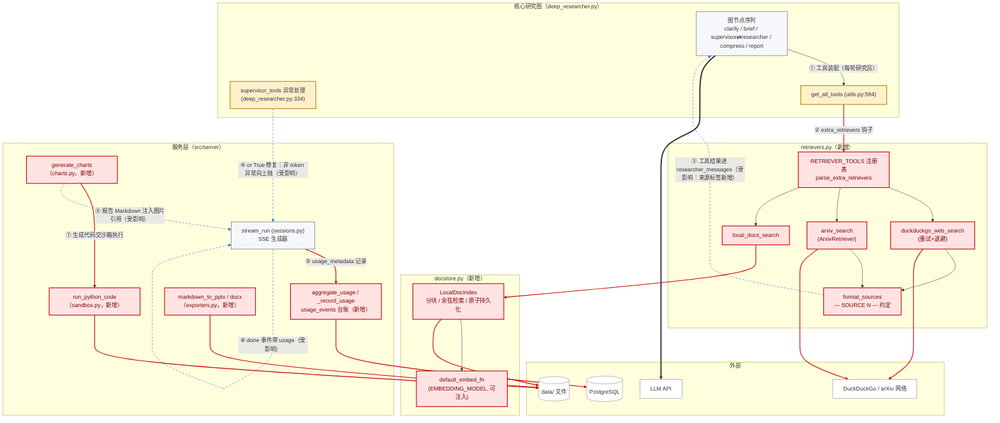
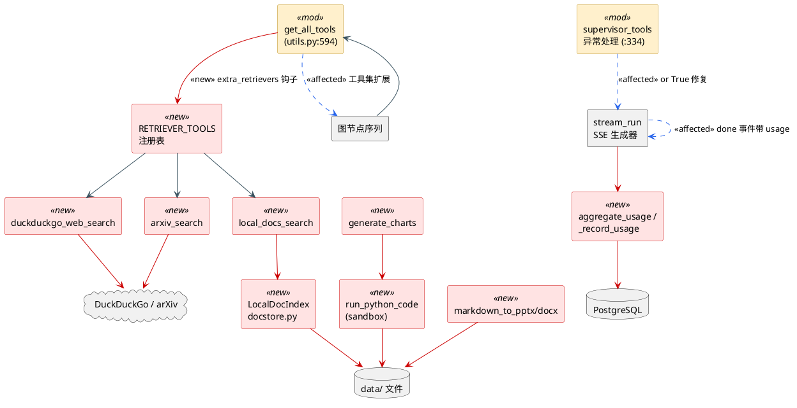

# C4 架构视图 L3 —— 组件图（Component，聚焦研究图与服务层内部）

> 红色 = **新增组件**；黄色描边 = **被修改的既有组件**（仅 3 处内核改动 + sessions 路由增强）；蓝色虚线 = **受影响的调用链**。

## 内核改动定位（全部改动清单）

| # | 位置 | 改动 | 行数 |
|---|---|---|---|
| 1 | `src/open_deep_research/configuration.py` | 增量字段 `extra_retrievers: Optional[str]` | +13 |
| 2 | `src/open_deep_research/utils.py:594`（get_all_tools 尾部） | `tools.extend(await load_extra_retrievers(config))` + 名称查重 | +10 |
| 3 | `src/open_deep_research/deep_researcher.py:334` | `or True` 异常吞噬修复：仅 token 超限静默结束，其余向上抛 | 净 +4 |
| — | 其余全部为新增文件 | retrievers.py / docstore.py / sandbox.py / charts.py / exporters.py / documents·export 路由 / UsageEvent / 迁移 0002 | 约 1100 行 |

## 同版本 PlantUML（Component 层）

