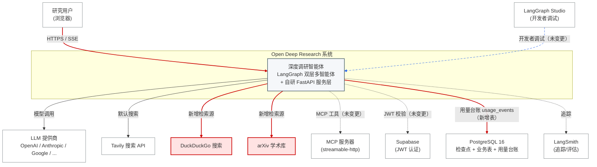

# C4 架构视图 L1 —— 系统上下文（System Context）

> 红色实线框/连线 = **本次新增模块与新增接口**；蓝色虚线 = **受本次变更影响的上下游依赖路径**。
> 变更基准：v0.0.16 + 自研服务层（详见 `docs/FULLSTACK_EXTENSION_PLAN.md` §8）+ 扩展模块（详见 `docs/TECHNICAL_SUMMARY.md` §8.3）。

## 本次变更在 L1 视图上的含义

| 变更 | 类型 | 说明 |
|---|---|---|
| DuckDuckGo / arXiv 检索源 | 新增外部交互 | 经 `extra_retrievers` 配置启用，未配置时零行为差异 |
| `usage_events` 用量台账 | 新增数据库表 | PostgreSQL 迁移 `0002`，独立于检查点表 |
| 用户 ↔ 系统 SSE 契约 | 接口扩展（向后兼容） | `done` 事件新增 `usage` 字段；`error` 语义增强（原静默失败现显式上报） |
| 本地文档库 | 新增内部能力 | 属 L2 视图的 `docstore` 组件（文件系统存储，无新增外部服务） |

> 完整调用链与受影响路径见 [C4_CONTAINER.md](C4_CONTAINER.md) 与 [C4_COMPONENT.md](C4_COMPONENT.md)。
